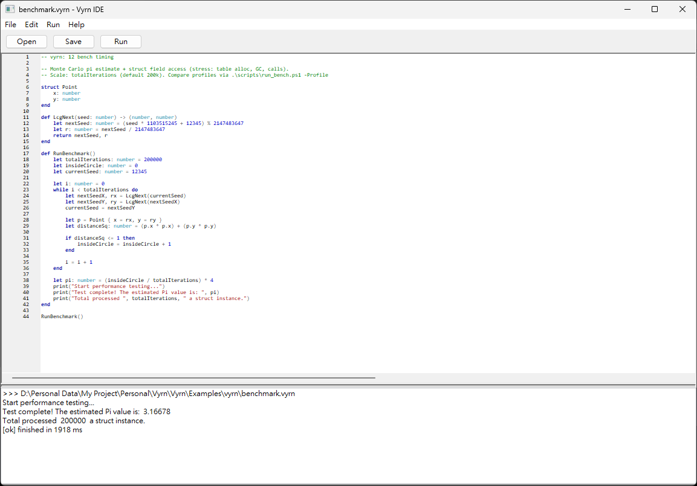

# VyrnIDE  

**VyrnIDE** is the official, ultra-lightweight IDE designed specifically for Vyrn development. Built for speed and simplicity, it allows you to start writing and testing scripts in seconds without any complex environment setup.  

  

## Features  

- **Featherweight & Portable**: Single standalone executable with virtually zero memory footprint.
- **Zero Configuration**: Double-click to open and start coding immediately — no plugins or runtime required.
- **Custom Syntax Highlighting**: Designed specifically for Vyrn's unique grammar and built-in functions.
- **Integrated Script Execution**: Write, run, and view output seamlessly within a unified panel.
- **Multi-File Support**: Open and navigate across multiple files seamlessly with zero impact on performance.

## Environment  

- Windows 11 above (recommend)  
- PureBasic 6.40 above (recommend)  

## How to Build  

Building requires PureBasic Compiler and test under Windows 11.  
Module features require PureBasic 5.20 and above.  

## License  

Copyright (c) 2026 Ji-Feng Tsai.  
Code released under the MIT license.  

## Donation  

If this application help you reduce time to coding, you can give me a cup of coffee :)  

  

[Paypal Me](https://paypal.me/jiowcl?locale.x=zh_TW)  
